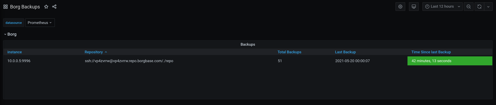

# borg-exporter [](https://ci.depode.com/danihodovic/borg-exporter)



A Prometheus exporter for [Borg](https://github.com/borgbackup/borg) backups.

It provides the following metrics:

Name     | Description | Type
---------|-------------|----
borg_backups_total | Total number of Borg backups | Gauge
borg_last_backup_timestamp | Timestamp of the last backup | Gauge

## Installation

Borg exporter runs as a Python binary managed by Systemd. It provides a command
to bootstrap into a simple systemd service.

To install the binary from Github:
```
curl -L https://github.com/danihodovic/borg-exporter/releases/download/latest/borg-exporter -o ./borg-exporter
chmod +x borg-exporter
sudo mv ./borg-exporter /usr/local/bin/
sudo borg-exporter enable-systemd
```
